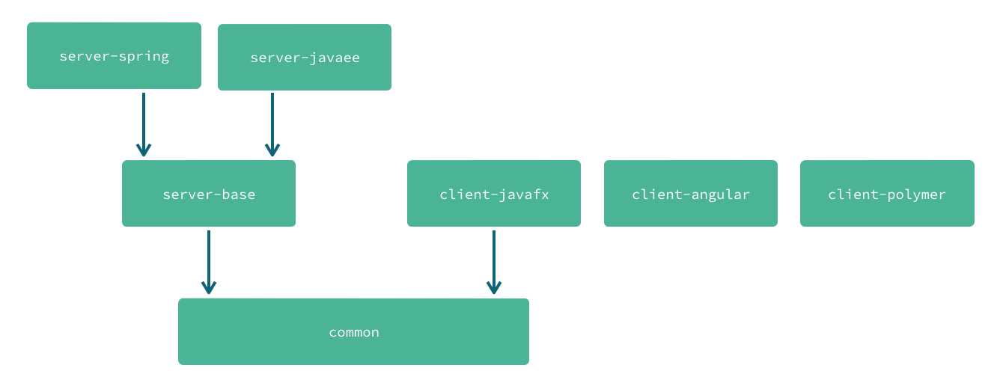

#ToDo List sample

This example contains a todo list that is shared between several clients.

##Modules

TODO

##Start the sample

###JavaEE server
`mvn wildfly:run`

###Spring Boot server
`mvn spring-boot:run`

###JavaFX client
`mvn jfx:run`

###Angular client
`mvn jetty:run`

###Polymer client
`mvn jetty:run`